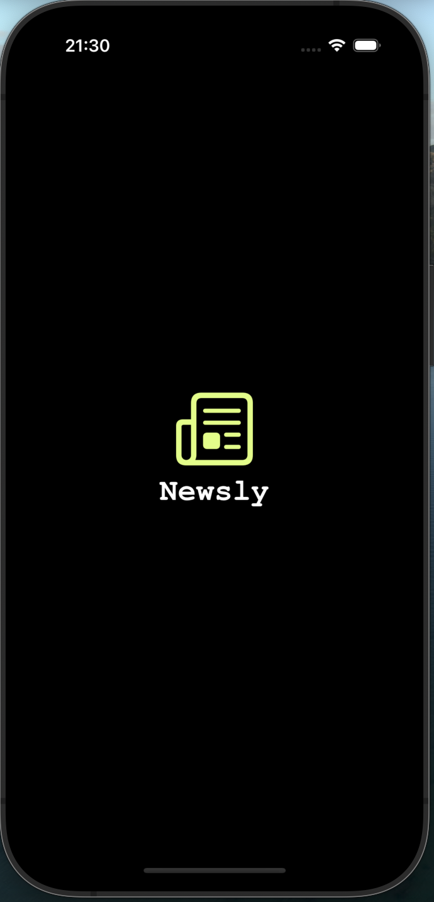
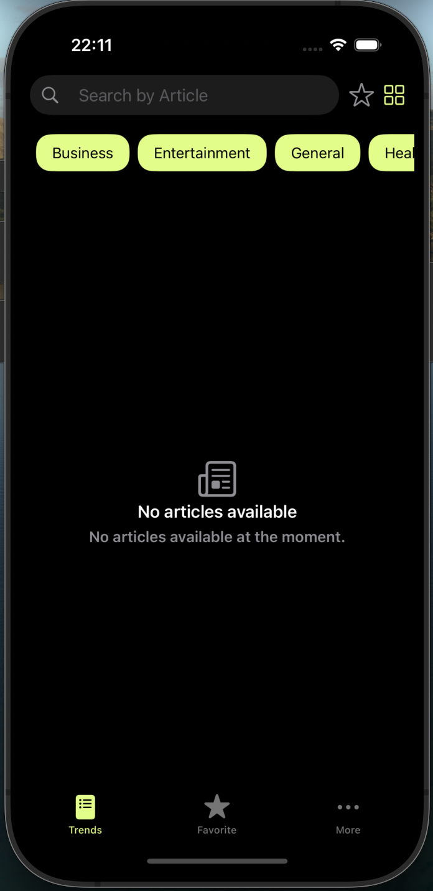
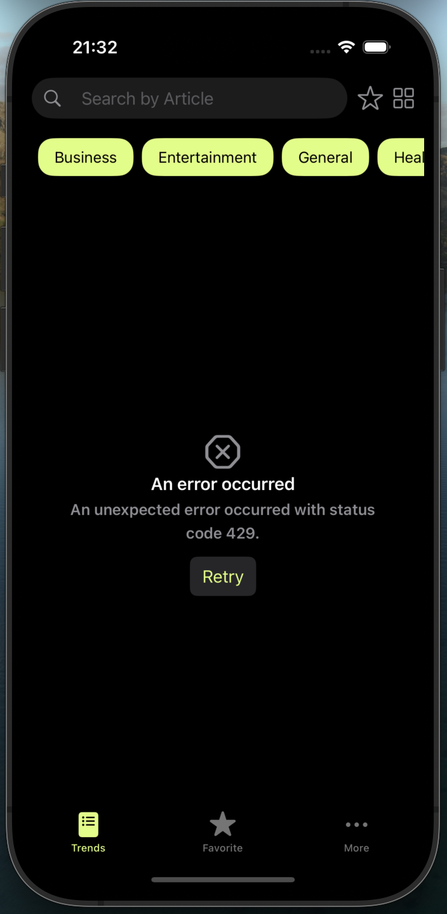
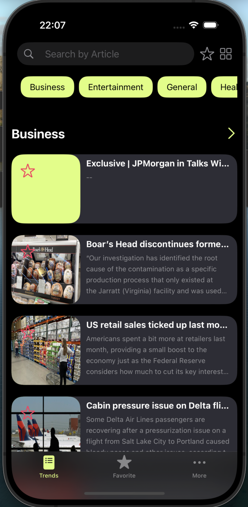
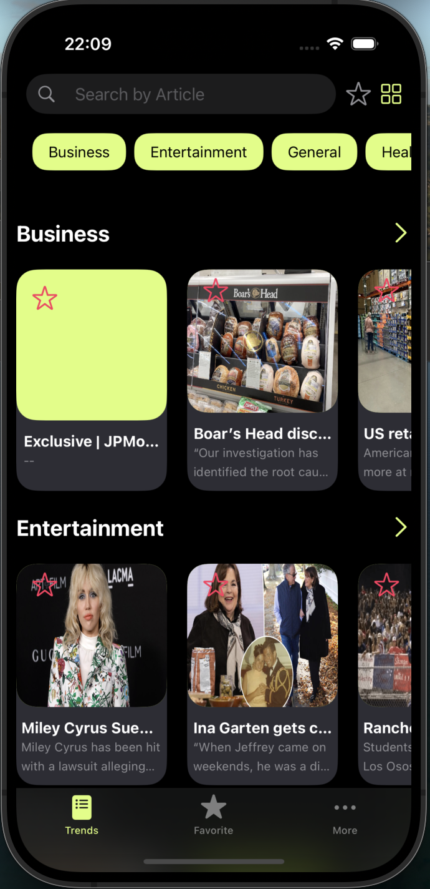
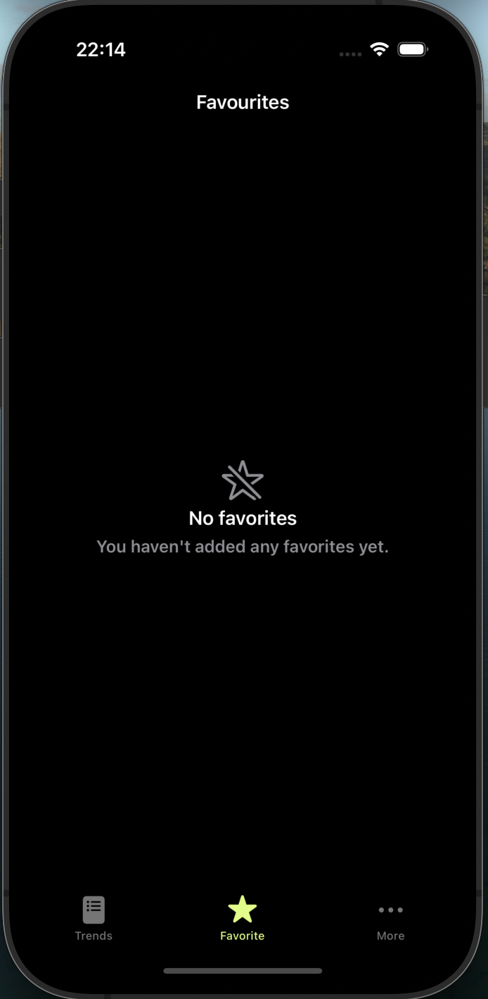
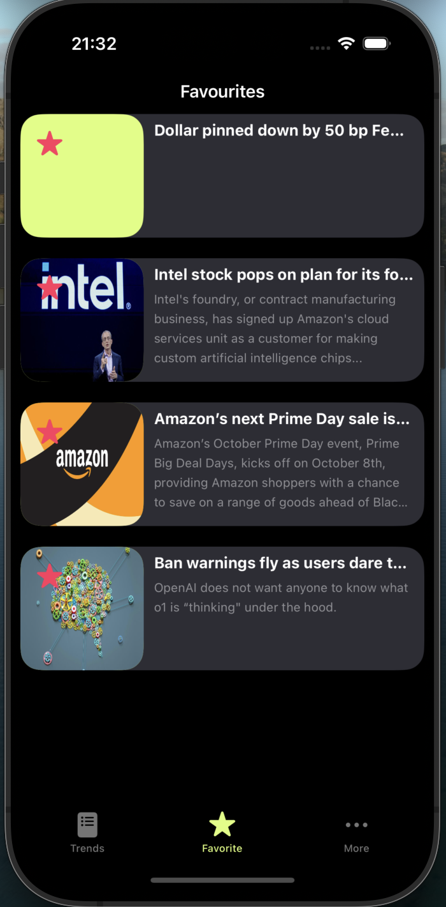
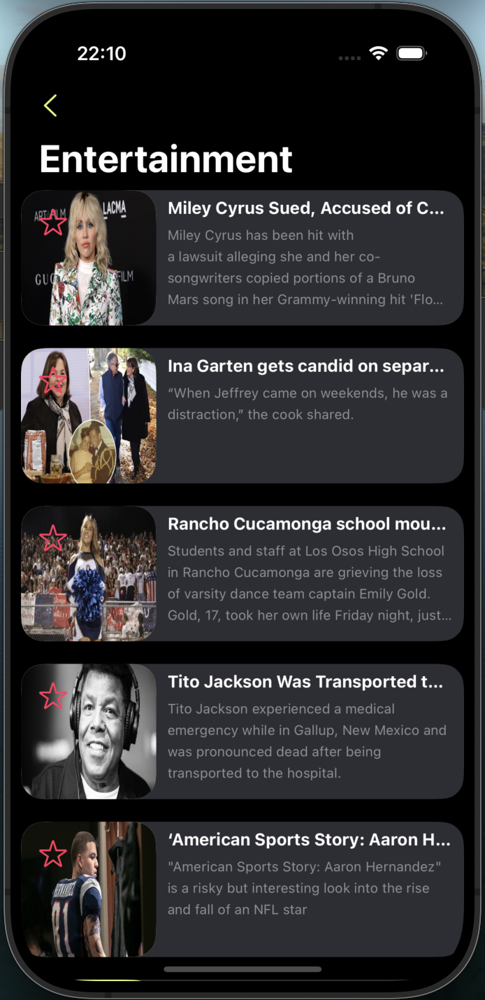
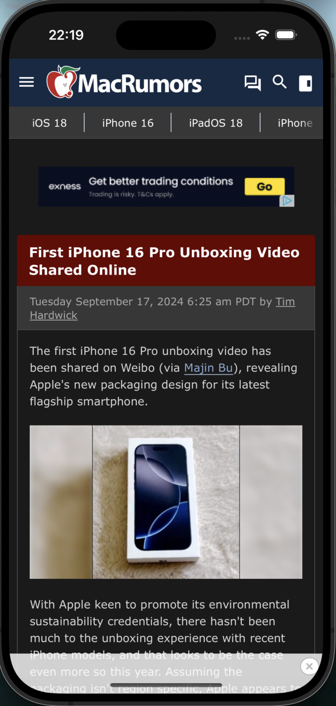

# Newsly

## App SnapShots

| Launch | TrendsEmpty | TrendsError |
| -- | -- | -- |
|  |  |  
| TrendsList | TrendsGrid | FavouriteEmpty |
| -- | -- | -- |
|  |  | 
| Favourites | CategoryList | News 
| -- | -- | -- |
|  |  | 

## Overview

Newsly is a SwiftUI-based iOS app designed to display news articles fetched from the NewsAPI. The app features a clean and simple interface that shows a list of 10 articles categorized by topic. You can filter the articles by category and switch between list and grid layouts for easier browsing.

When you select a category, Newsly navigates to a new screen displaying all the articles from that category. The app also allows you to add articles to your favorites, which are saved offline, so you can access them even without an internet connection.

## Tech Stack

- Xcode 15.3
- macOS Sonoma 14.5
- iOS 17
- Swift 5.9
- SwiftUI
- SDWebImage ThirdParty

- ## Features Highlights

- At the time of app launch, if there is no internet connection, the app will automatically redirect to the favorites section. If no favorite articles are saved, a placeholder view (e.g., "No Favorites") will be displayed.

- When the App(Newsly) detects an internet connection after being offline, it will automatically navigate to the Trends section, providing you with the latest news updates.

- Newsly remembers your last selected layout option (Grid or List). When you relaunch Newsly, it will display the layout you chose during your last session, ensuring a personalized experience.

- Newsly stores all your favorite articles locally using CoreData, ensuring you can access them even when the internet is unavailable. This allows you to easily view and manage your saved articles offline, while the rest of the app continues to fetch live news when you're connected [CoreData](https://developer.apple.com/documentation/coredata/).

### Architecture

- Newsly follows the MVVM (Model-View-ViewModel) architecture, ensuring a clean and maintainable codebase.

### Customizations
  
- Custom NavigationStack: The app features a custom navigation stack for enhanced navigation and user experience.

- Custom NetWorkLayer: I've implemented a modern async/await-based URLSession APIClient inspired by Moya for efficient and clean network requests using URLSession.

## Getting Started

To get started with Sacrena, follow these simple steps:

1. Clone the project from the provided GitHub repository.

2. Open the project in Xcode.

3. Build and run the app on your iOS device or simulator.

## Support and Contact

If you have any questions or need assistance, please contact ganeshrajugalla@gmail.com.

I hope you enjoy using Newsly and find it a valuable addition to staying informed with the latest news. Happy reading!

